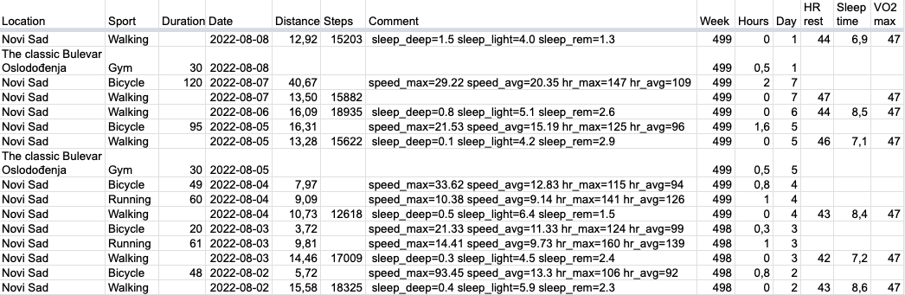

# garmin-dayly

Fill Google Sheets with fitness data from Garmin Connect.

## Installation

    pip install garmin-daily

## Credentials

### Garmin Connect
Place login and password into env vars `GARMIN_EMAIL` and `GARMIN_PASSWORD` respectfully

    export GARMIN_EMAIL="andrey@sorokin.engineer"
    export GARMIN_PASSWORD='password'

### Google Sheets
Get Google credentials for Google Sheet as explained in [gspread:Using Service Account](https://docs.gspread.org/en/latest/oauth2.html#enable-api-access-for-a-project)
Place it to `~/.config/gspread/service_account.json`.

Do not forget to grant access to you sheets for this service emails.

## Google Sheet structure

Expected columns:

- Location
- Sport
- Duration
- Date
- Distance
- Steps
- Comment
- Week
- Hours
- Week Day
- HR rest
- Sleep time
- VO2 max

First row should be with the columns' titles.

You can add another column titles in the mapping [COLUMNS_MAP](docstrings/columns_mapper/)

## garmin-daily command line interface

To add rows to Google Sheet from Garmin Connect, use `garmin-daily`, get help with

    garmin-daily --help

At minimum, you specify Google Sheet name and that's all

    garmin-daily --sheet "My Fitness"

It also can automatically create you gym trainings if you have them
on specific days.
It's easier to correct already created rows then to create them
manually from scratch.

List the week days with gym trainings in the parameters
and specify your gym location and usual training duration:

    garmin-daily --sheet "My Fitness" \
        -g mon -g tue -g fri \
        --gym-duration 30 \
        --gym-location "Cool place"

# GitHUB

[sorokin.engineer/garmin-daily](https://github.com/andgineer/garmin-daily)
