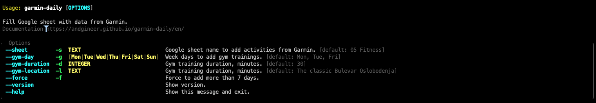

# garmin-daily

Fill Google Sheets with fitness data from Garmin Connect.


## Installation
Install using [`pipx`](https://pypa.github.io/pipx/) for isolated environments, which prevents interference 
with your system's Python packages:

=== "MacOS"
    ```bash
    brew install pipx
    pipx ensurepath
    ```

=== "Linux"
    ```bash
    python3 -m pip install --user pipx
    python3 -m pipx ensurepath
    ```

=== "Windows"
    ```bash
    # If you installed python using the app-store, replace `python` with `python3` in the next line.
    python -m pip install --user pipx
    ```

**Final Step**: Once `pipx` is set up, install `garmin-daily`:

```bash
pipx install garmin-daily
```

## Command Line Interface
??? note "garmin-daily --help"
    

### Basic Usage
At a minimum, you only need to specify the Google Sheet name:
```bash
garmin-daily --sheet "My Fitness"
```

### Advanced Usage
The app can also help create your gym schedule based on your workout days. 
It's often easier to edit existing rows than to create new ones from scratch.

To list the weekdays when you have gym training, specify your gym location, 
and set the usual training duration, use:
```bash
garmin-daily --sheet "My Fitness" \
    -g mon -g tue -g fri \
    --gym-duration 30 \
    --gym-location "Cool place"
```

## Credentials

### Garmin Connect
Place login and password into env vars `GARMIN_EMAIL` and `GARMIN_PASSWORD` respectfully

    export GARMIN_EMAIL="andrey@sorokin.engineer"
    export GARMIN_PASSWORD='password'

### Google Sheets
Get Google credentials for Google Sheet as explained in [gspread:Using Service Account](https://docs.gspread.org/en/latest/oauth2.html#enable-api-access-for-a-project)
Place it to `~/.config/gspread/service_account.json`.

Do not forget to grant access to you sheets for this service emails.

## Google Sheet structure

??? optional-class "Expected columns"
    - Location
    - Sport
    - Duration
    - Date
    - Distance
    - Steps
    - Comment
    - Week
    - Hours
    - Week Day
    - HR rest
    - Sleep time
    - VO2 max

First row should be with the columns' titles.

You can add another column titles in the mapping [COLUMNS_MAP](../docstrings/columns_mapper/).
