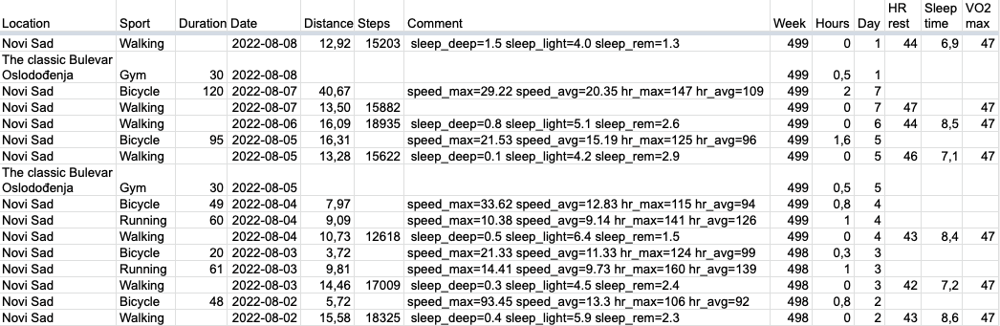

# garmin-daily

Fill Google Sheets with fitness data from Garmin Connect.



## Installation
To install in isolated environments so it won't mess with your system python packages, 
use [pipx](https://pypa.github.io/pipx/)

=== "MacOS"
    ```bash
    brew install pipx
    pipx ensurepath
    ```

=== "Linux"
    ```bash
    python3 -m pip install --user pipx
    python3 -m pipx ensurepath
    ```

=== "Windows"
    ```bash
    # If you installed python using the app-store, replace `python` with `python3` in the next line.
    python -m pip install --user pipx
    ```

Then install `garmin-daily` with pipx
```bash
pipx install garmin-daily
```

## Credentials

### Garmin Connect
Place login and password into env vars `GARMIN_EMAIL` and `GARMIN_PASSWORD` respectfully

    export GARMIN_EMAIL="andrey@sorokin.engineer"
    export GARMIN_PASSWORD='password'

### Google Sheets
Get Google credentials for Google Sheet as explained in [gspread:Using Service Account](https://docs.gspread.org/en/latest/oauth2.html#enable-api-access-for-a-project)
Place it to `~/.config/gspread/service_account.json`.

Do not forget to grant access to you sheets for this service emails.

## Google Sheet structure

??? optional-class "Expected columns"
    - Location
    - Sport
    - Duration
    - Date
    - Distance
    - Steps
    - Comment
    - Week
    - Hours
    - Week Day
    - HR rest
    - Sleep time
    - VO2 max

First row should be with the columns' titles.

You can add another column titles in the mapping [COLUMNS_MAP](api-reference/columns_mapper/)

## garmin-daily command line interface

To add rows to Google Sheet from Garmin Connect, use `garmin-daily`, get help with

    garmin-daily --help

At minimum, you specify Google Sheet name and that's all

    garmin-daily --sheet "My Fitness"

The app can make your gym schedule for you based on your workout days.
It's easier to edit existing rows than to create new ones from scratch.

List the week days with gym trainings in the parameters
and specify your gym location and usual training duration:

    garmin-daily --sheet "My Fitness" \
        -g mon -g tue -g fri \
        --gym-duration 30 \
        --gym-location "Cool place"

